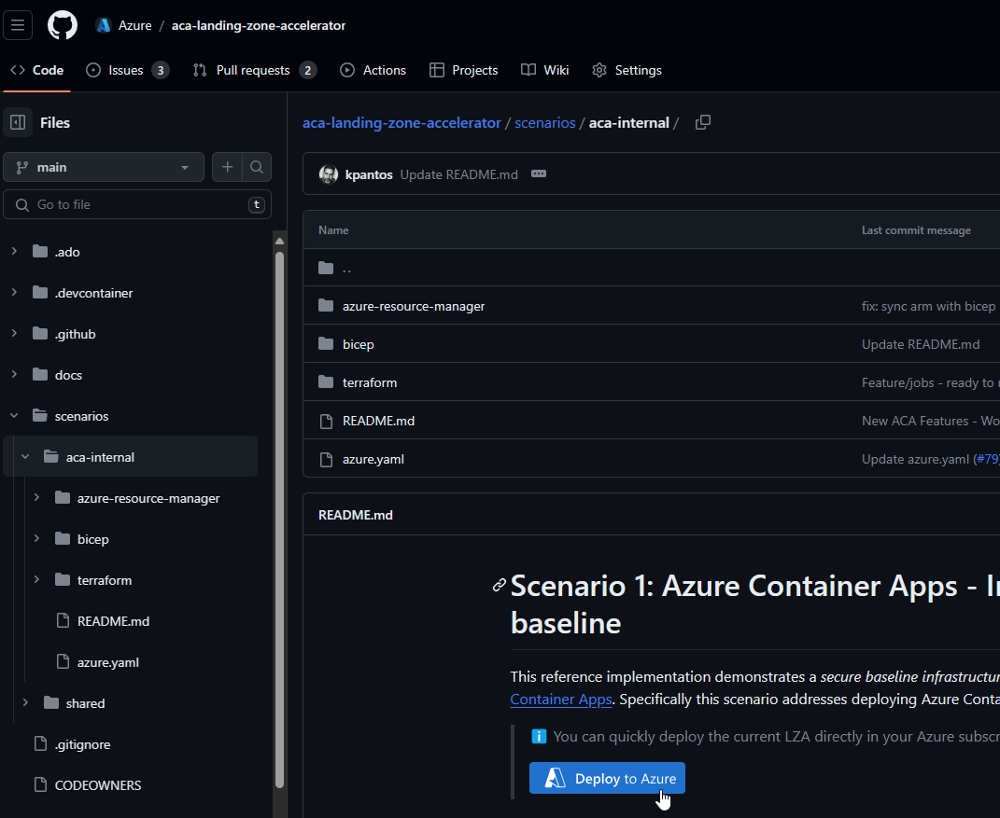

## Prerequisites: 
-   You need to be owner of the Azure subscription you will use to deploy the ACA LZA.

-   The following resource providers should be     [registered](https://learn.microsoft.com/el-gr/azure/azure-resource-manager/management/resource-providers-and-types#register-resource-provider)
    before you start deployment:

    -   Microsoft.App

    -   Microsoft.ContainerRegistry

    -   Microsoft.ContainerService

    -   Microsoft.KeyVault

## Pre-work:

The deployment of a full blown ACA-LZA might take well above 30 minutes.
During the lab, it would be great if you have already an ACA LZA deployed, so that we can focus on how you deploy Azure Container Jobs, and lose no time on deploying the LZA.

The easiest way to deploy ACA-LZA -- without any sample applications - is described below:

1.  Head to **aka.ms/aca-lza,** and then navigate to     **scenarios/aca-internal.**

2.  Click on the "Deploy to Azure" button

{: width="400" height="300"}

3.  Select the correct subscription (one that you are owner), and in the first step of the deployment wizard enter

    a.  A workload name that you like

    b.  Environment name (i.e. dev)

    c.  Deploy Zone redundant Resources: false (for cost reasons, and reduced deployment times)

    d.  Deploy Azure Policies: true

    e.  Everything else default or void values

> {: width="400" height="300"}

4.  Next step, "Network Settings". Keep the default values, is OK for testing purposes

5.  "Jump-Box settings (VM)" step: Select VM OS type" \> Linux. Keep the default VM Size is OK for the testing purposes. Add a strong password for the azureuser

{ width="400" height="300"}

6.  **"Deployment Feature Flags"** step: the most important flags to set are: 
    a.  Deploy Bastion**:** true (So that you can have access to the Jump-box)
    b.  Deploy Hello World Sample: false (We do not need to deploy a sample app and application gateway. We will deploy the Jobs Sample app as a lab during the training.
    c.  For Cost reasons and reduced deployment time we also recommend the following settings:
        i.  Deploy Redis cache: false
        ii. Enable Application Insights: false
        iii. Enable Dapr Instrumentation: false
        iv. Enable DDoS Protection: Disabled

{ width="400" height="300"}

7.  Then click on "Review and Create"

With these settings, the deployment should take around 30 minutes.
